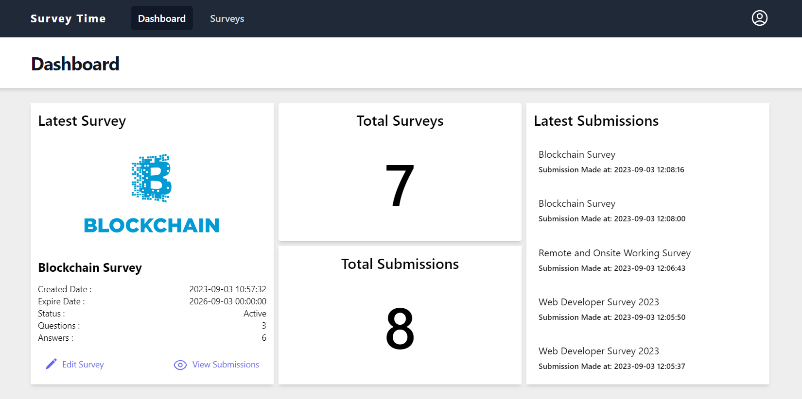
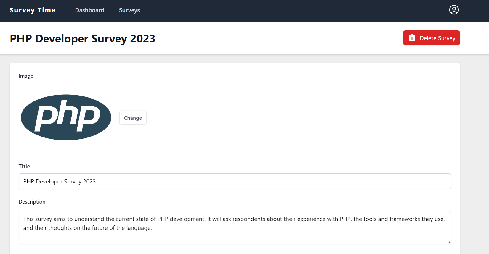
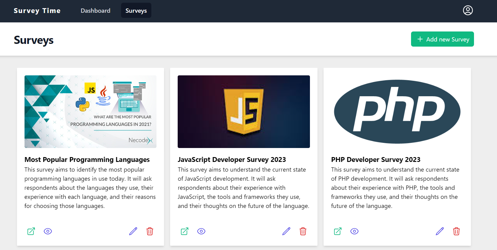
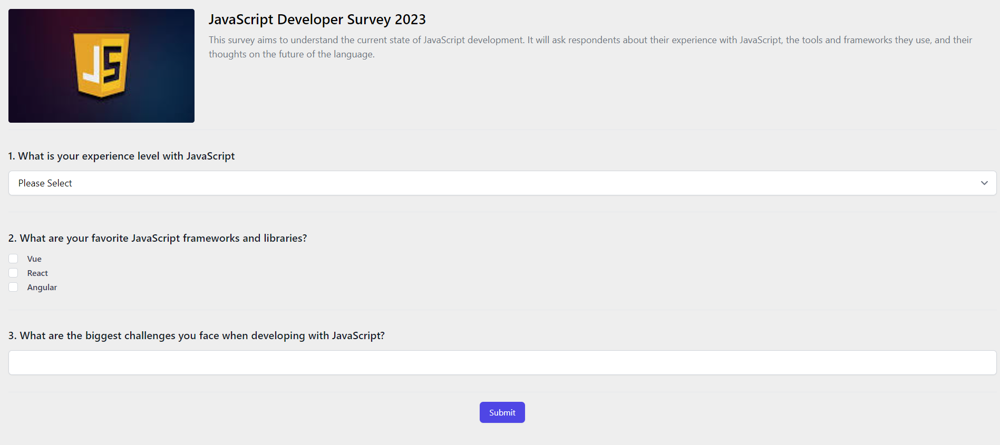

## Surveys

Web application for creating surveys and sharing them with others to gather their responses, built using Vue, Vuex, Tailwind CSS as front-end and Laravel as back-end.

## Installation

#### Laravel

```shell
   # Install dependencies
   composer install

   # Create .env file with your configurations
   cp .env.example .env

   # Generate new key
   php artisan key:generate

   # Upload database
   php artisan migrate

   # Run server
   php artisan serve

   # Run laravel web socket server
   php artisan websockets:serve
```

#### Vue

```shell
   # Enter Vue directory
   cd vue

   # Install npm dependencies
   npm install

   # Create .env file with your configurations
   # Set your backend api URL
   cp .env.example .env

   # Run vite server
   npm run dev
```

## Screen Shots

<p align="center">




</p>
